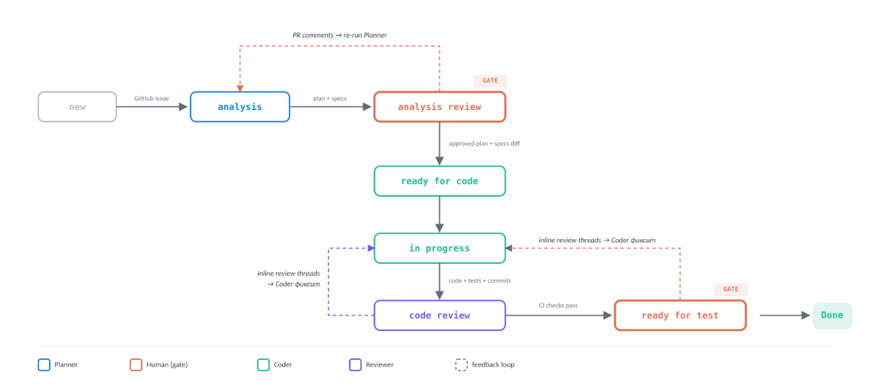

Teams usually go through a few maturity stages when they start using agents in software development:

1. **LLM as autocomplete**: suggests the next chunk of code inside the editor. It does not see the whole system. It does not remember much between prompts. It helps with local code.
2. **Agent as a coding partner**: writes code while the developer defines the task, steers the work, and checks the result. Each run still starts from scratch. Project invariants and file relationships have to be loaded into the prompt again. Sometimes it breaks working code because it does not know why that code exists.
3. **Agentic development pipeline**: agents stop working as isolated helpers. They become a pipeline with separate roles. Specs give them shared knowledge about the system. The developer moves from writing code to approving key decisions.
4. **Agentic SDLC**: the pipeline covers the whole lifecycle, from issue intake to production incidents. The developer stays at the highest level: strategy and acceptance.

Most teams that actively use AI are somewhere around stages 2 and 3. My own development process is currently at stage 3. This is what it looks like.

My setup has three parts.

**Specs driven dev.** Specs first, then plan, then code. In that order. An agent understands the system because it has specs. Specs also give the reviewer a way to catch overreach: if the code does something outside the requirements, it is a bug even when the code works. If the code contradicts the requirements, that is also a bug. The spec defines the task first, then becomes the acceptance criterion.

**Orchestrator and step agents.** One agent updates specs and writes the plan. Another implements the plan: code and tests. A third reviews the result. The orchestrator does not write code. It only decides whose turn it is. Each agent has its own tools, prompts, and restrictions. This keeps the blast radius small. The clearest example is the reviewer. It has no write tools, so it literally cannot break a line of code. It can only leave comments.

**Synchronization through GitHub PRs.** The pipeline state lives in PR labels. The conversation between the developer and the agents, and between the agents themselves, happens in inline threads. No separate coordination channel is needed. The label is the source of truth for the orchestrator. It reads the label, starts the right agent, and sets the next label when the step is done. The orchestrator is stateless: between runs, it remembers nothing. It derives the phase from the label. That means it can be stopped and restarted at any time. The work continues from the right place.

The developer is involved at two quality gates: approving spec and plan changes, and accepting the result. The orchestrator cannot pass through them on its own. Everything else is automated so the developer has two points of control.
